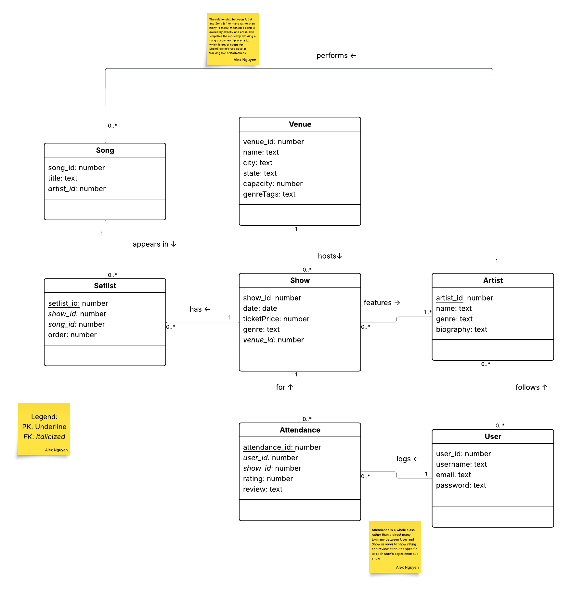
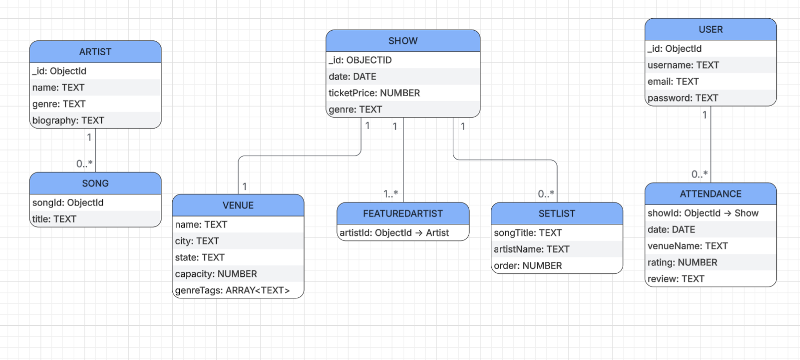

# CS3200_Project2
In this practicum we will modify the database we built for Project 1 to adjust it to a document based database (Mongo). Finally I will modify the implementation from Project 1 to make it work with MongoDB and Node.

## 1. (5 pts) Provide the problem requirements and the conceptual model in UML for your project. You can reuse the ones made in Project 1.

### Requirements
**File:** [`documents/requirements.pdf`](documents/requirements.pdf)

### UML 
**File:** [`diagrams/uml_conceptual_model.png`](diagrams/uml_conceptual_model.png)

## 2. (15 pts) Adapt the Logical Data model from your Project 2 to have hierarchical tables. This is, main (root) tables from which all the other tables relate to. This main tables will become later your Mongo Collections. From your main tables you can have aggregation/composition, one to many and many to many relationships.

## 3.  (10 pts) From this logical model define the main Collections (Documents/Tables) you will be using in your Mongo Database. Provide a couple of JSON examples of these objects with comments when necessary. Think about a document that you will give to another database engineer that would take over your database. From the same presentation:

**File:** [JSON_Examples.md](JSON_Examples.md)

## 4.  (15 pts) Populate the tables with test data. You can use tools such as https://www.mockaroo.com/schemasLinks to an external site. or  https://www.generatedata.com/Links to an external site.. You can export the sample data to JSON and then use mongoimport or Mongo Compass to populate your tables. Include in your repository a dump file that can be use to regenerate your database, and the instructions on how to initialize it. You should share the instructions on how to import these data into tables by providing the data in JSON format and instructions on how to load it using mongoImport or mongo Compass

### Data Files
- [`data/artists.json`](data/artists.json)
- [`data/shows.json`](data/shows.json)
- [`data/users.json`](data/users.json)
- [`seed.js`](seed.js)

### Option 3: seed script

docker exec -i mongodb mongosh showtracker < seed.js

### Option 2: Import from JSON files
mongoimport --db showtracker --collection artists --file artists.json --jsonArray
mongoimport --db showtracker --collection shows --file shows.json --jsonArray
mongoimport --db showtracker --collection users --file users.json --jsonArray

## 5. (30 pts) Define and execute at least five queries that show your database. At least one query must use the aggregation framework https://docs.mongodb.com/manual/aggregation/Links to an external site., one must contain a complex search criterion (more than one expression with logical connectors like $or), one should be counting documents for an specific user, and one must be updating a document based on a query parameter (e.g. flipping on or off a boolean attribute for a document, such as enabling/disabling a song)

### Queries
- [`Queries/Query1.js`](Queries/Query1.js) — Aggregation: Average rating per venue
- [`Queries/Query2.js`](Queries/Query2.js) — Complex search: Rock/Indie shows under $60
- [`Queries/Query3.js`](Queries/Query3.js) — Count: Shows attended by ethan07
- [`Queries/Query4.js`](Queries/Query4.js) — Update: Toggle active status for Rock artists
- [`Queries/Query5.js`](Queries/Query5.js) — Top 5 most attended shows with $lookup